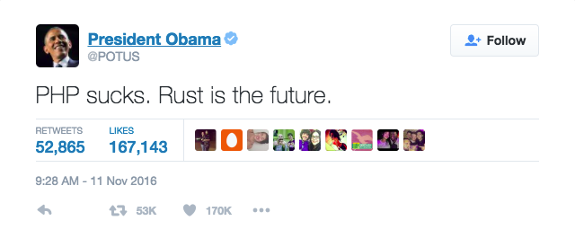
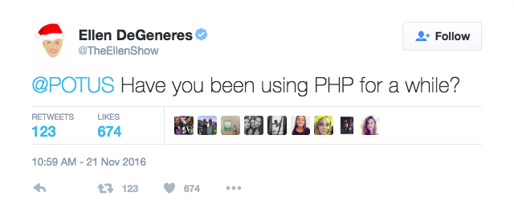
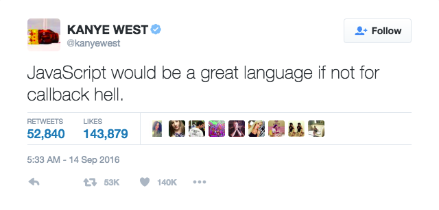
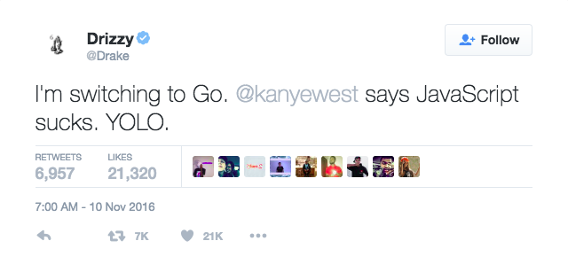
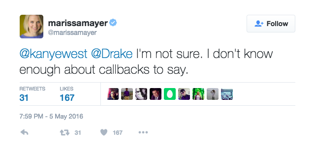
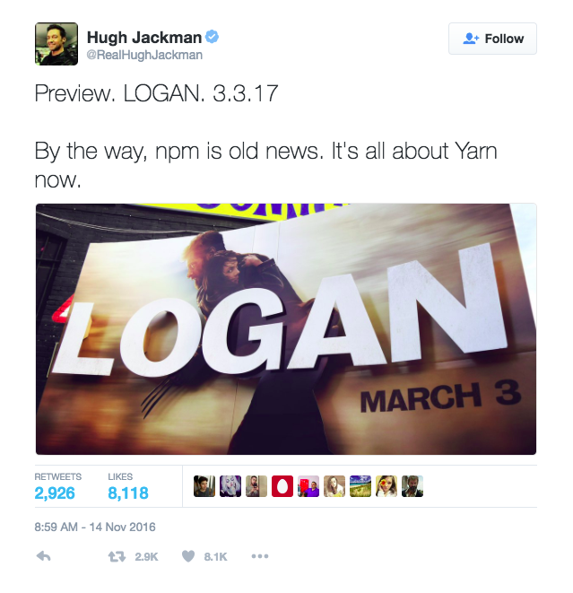
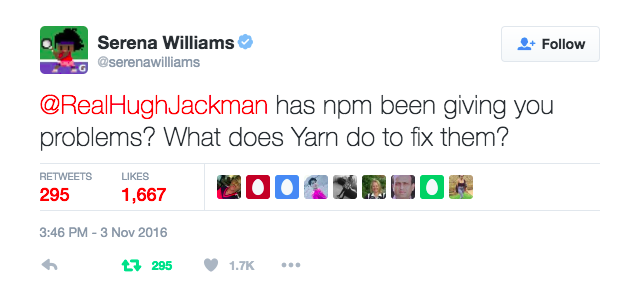

[fit] Reevaluate your
=====================
[fit] opinions
==============

by _Nizar Khalife_


---





---


Could that be from years of
---------------------------
[fit] experience?
=================


---


Or just 'cause
--------------
[fit] blurrrrh
==============
they hate dollar signs and semicolons?
--------------------------------------

```php
$thing = "Hello";
```


---


Is that opinion
---------------
[fit] researched?
=================


---


Is that opinion
---------------
[fit] _current_?
================


---


Or did you just become a walking
--------------------------------
[fit] Web trend
===============
[fit] meme?
===========


---





---


If your experience is limited,
------------------------------
[fit] qualify
=============
your statement.
---------------


---


> I tried PHP 5 for about a month and I didn't like it.
-- Fixed that for you, Obama.


---





---


Rash opinions influence those
-----------------------------
that don't take things with
---------------------------
[fit] a grain of salt.
======================


---





---


[fit] Be transparent
====================
about the limits of your knowledge when criticizing.
----------------------------------------------------


---





---


> I don't know how to handle callback hell in JavaScript.
-- Fixed that for you, Kanye.


---





---


Avoid sweeping statements.
--------------------------
[fit] Ask more
==============
[fit] questions.
================


---


Being a great developer is not about appearing to
-------------------------------------------------
[fit] know everything.
======================


---


Find opportunities to
---------------------
[fit] learn
===========
from people who know more.
--------------------------


---





---


[fit] Reserve judgement.
========================
[fit] Be open.
==============


---


Check yourself before you
-------------------------
[fit] wreck
===========
yourself.
---------


---


